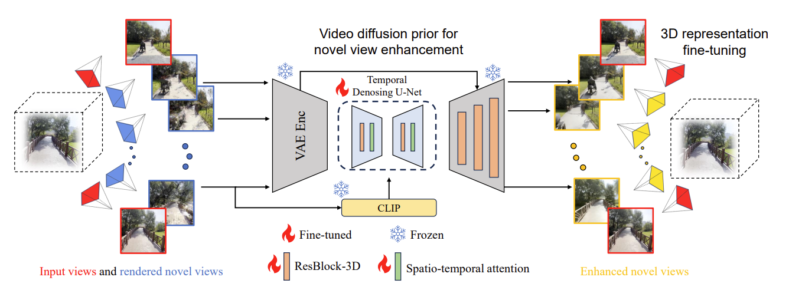

# 3DGS-Enhancer: Enhancing Unbounded 3D Gaussian Splatting with View-consistent 2D Diffusion Priors 
## (NeurIPS 2024 $\textcolor{red}{Spotlight}$)

[**Paper**](https://arxiv.org/abs/2410.16266) | [**Project Page**](https://xiliu8006.github.io/3DGS-Enhancer-project/)

[Xi Liu](https://xiliu8006.github.io/), [Chaoyi Zhou](https://chaoyizh.github.io/chaoyizh-home-page/), [Siyu Huang](https://siyuhuang.github.io/#)

## Abstract
Abstract: Novel-view synthesis aims to generate novel views of a scene from multiple input images or videos, and recent advancements like 3D Gaussian splatting (3DGS) have achieved notable success in producing photorealistic renderings with efficient pipelines. However, generating high-quality novel views under challenging settings, such as sparse input views, remains difficult due to insufficient information in under-sampled areas, often resulting in noticeable artifacts. This paper presents 3DGS-Enhancer, a novel pipeline for enhancing the representation quality of 3DGS representations. We leverage 2D video diffusion priors to address the challenging 3D view consistency problem, reformulating it as achieving temporal consistency within a video generation process. 3DGS-Enhancer restores view-consistent latent features of rendered novel views and integrates them with the input views through a spatial-temporal decoder. The enhanced views are then used to fine-tune the initial 3DGS model, significantly improving its rendering performance. Extensive experiments on large-scale datasets of unbounded scenes.

## Method

 TL;DR: We propose a method that exploits view-consistent 2D generative priors, i.e., a video diffusion model, to enhance 3D Gaussian splatting rendering quality.

<!-- <video controls>
  <source src="./assets/3DGS-Enhancer.mp4" type="video/mp4">
  Your browser does not support the video tag.
</video> -->

## Codebase
**1. 3dgs_dataset_generator:** For paired dataset generation. 
**2. SVDFor3D:** Train SVD for 3DGS-Enhancer with paired dataset. 

## Not available yet
1. STD: Spatial-temporal decoder
2. Confidence-aware 3DGS

## Reference
@inproceedings{liu20243dgs,
  title={3dgs-enhancer: Enhancing unbounded 3d gaussian splatting with view-consistent 2d diffusion priors},
  author={Liu, Xi and Zhou, Chaoyi and Huang, Siyu},
  booktitle={Advances in Neural Information Processing Systems},
  year={2024}
}
